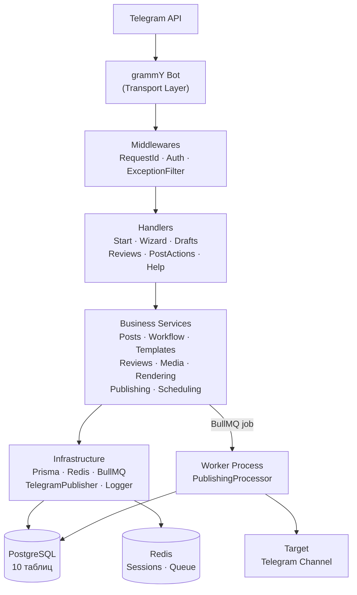
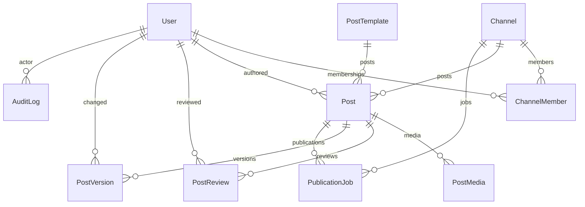
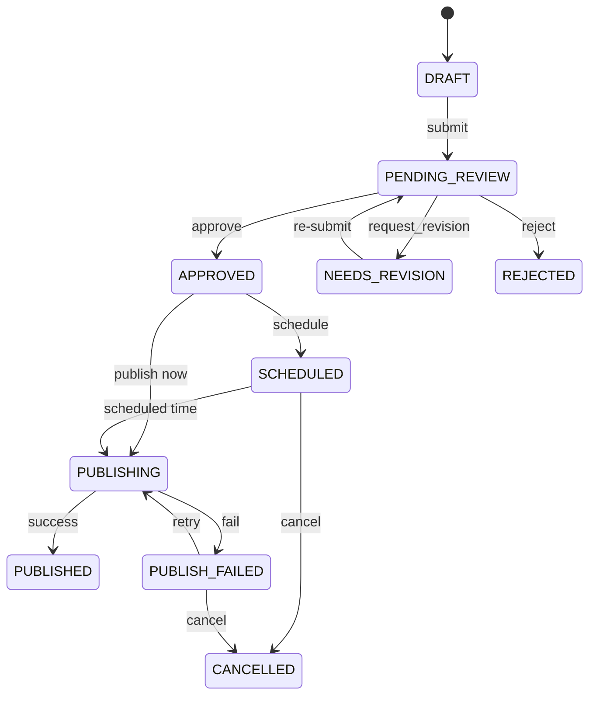
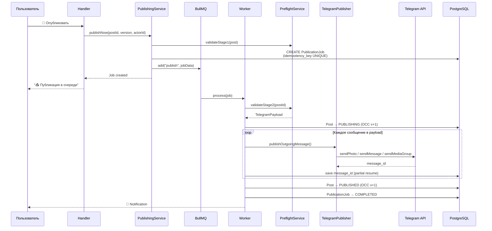

# Telegram Content Publisher Bot — Полная документация проекта

> **Актуальность:** 22 сентября 2026, 09:49 (commit `307a14e`)
> **Цель:** понять проект за 15 минут и продолжить работу.

---

## Навигация

| Блок | Для кого | Время |
|------|---------|-------|
| [**1. Быстрый старт**](#1-быстрый-старт) | Новый разработчик | 5 мин |
| [**2. Архитектура и бизнес-логика**](#2-архитектура-и-бизнес-логика) | Разработчик, которому нужно писать код | 15 мин |
| [**3. Как продолжать работу**](#3-как-продолжать-работу) | Тот, кто берёт проект в работу | 5 мин |

---

# 1. Быстрый старт

## Что это

Редакционная панель **внутри Telegram**. Бот для создания, согласования, планирования и надёжной публикации контента в Telegram-каналы.

> Пользователь не запоминает команды — основные действия через кнопки и пошаговый wizard.

## Стек

| Слой | Технология | Версия |
|------|-----------|--------|
| Runtime | Node.js | 24.14 LTS |
| Язык | TypeScript (strict, zero `any`) | 5.7 |
| Framework | NestJS | 11.x |
| Telegram SDK | grammY + @grammyjs/runner | 1.35 |
| СУБД | PostgreSQL | 17 |
| ORM | Prisma | 6.19 |
| Кэш / Очереди | Redis 7 + BullMQ | 5.41 |
| Контейнеры | Docker Compose | v3.8 |
| Тесты | Jest (unit) + node:test (E2E) | 29.x |

## Два процесса

| Процесс | Entry point | Назначение |
|---------|-------------|-----------|
| **App** | [`src/main.ts`](file:///c:/TgHelp/src/main.ts) | HTTP-сервер (health + webhook) + grammY бот |
| **Worker** | [`src/worker.main.ts`](file:///c:/TgHelp/src/worker.main.ts) | BullMQ worker: публикация + scheduling |

## Quick Start (5 шагов)

```bash
# 1. Зависимости
npm install

# 2. Инфраструктура (PostgreSQL + Redis)
docker compose up postgres redis -d

# 3. Окружение
cp .env.example .env
# → Заполнить BOT_TOKEN и INITIAL_SUPER_ADMIN_TELEGRAM_ID

# 4. База данных
npx prisma generate
npx prisma migrate dev
npm run prisma:seed       # admin + канал + 6 шаблонов

# 5. Запуск (два терминала)
npm run start:dev          # App: бот + HTTP
npm run start:worker:dev   # Worker: публикация
```

**Проверка:**
```bash
curl http://localhost:3000/health   # { status: "ok", uptime, timestamp }
curl http://localhost:3000/ready    # { status: "ok", checks: { database, redis } }
```

## Environment Variables

```env
BOT_TOKEN=                          # Обязательно — Telegram Bot API token
DATABASE_URL=postgresql://...       # Обязательно — PostgreSQL
REDIS_URL=redis://...               # Обязательно — Redis
DEFAULT_TIMEZONE=Europe/Kyiv        # Обязательно — timezone каналов
PORT=3000                           # HTTP порт
TELEGRAM_MODE=polling               # polling | webhook
WEBHOOK_DOMAIN=                     # Только для webhook
WEBHOOK_PATH=/telegram/webhook
WEBHOOK_SECRET_TOKEN=
INITIAL_SUPER_ADMIN_TELEGRAM_ID=    # Telegram ID первого admin
DEFAULT_CHANNEL_CHAT_ID=            # Chat ID целевого канала
LOG_LEVEL=info
```

Env-переменные валидируются при старте (fail-fast): [`environment.validation.ts`](file:///c:/TgHelp/src/infrastructure/config/environment.validation.ts)

## Docker Compose

```yaml
services:
  postgres:   # PostgreSQL 17, port 5432, healthcheck
  redis:      # Redis 7, port 6379, AOF, healthcheck
  app:        # NestJS app (main.ts), port 3000
  worker:     # BullMQ worker (worker.main.ts)
```

---

# 2. Архитектура и бизнес-логика

## 2.1. Общая архитектура



> [!IMPORTANT]
> **Telegram = транспорт.** Handlers парсят update → вызывают сервисы → рендерят ответ.
> Бизнес-логика, Prisma, прямые вызовы Telegram API — запрещены в handlers.

## 2.2. Структура папок

```
src/                          106 файлов
├── main.ts                   App bootstrap
├── app.module.ts             19 module imports
├── worker.main.ts            Worker bootstrap
├── worker.module.ts          8 module imports
│
├── common/
│   ├── constants/
│   │   ├── queue-names.ts          Имена BullMQ очередей
│   │   └── telegram-limits.ts     Лимиты Telegram API (централизованно)
│   ├── dto/                       Общие DTO
│   ├── enums/index.ts             PostAction, ChannelPermission, AuditAction
│   └── exceptions/
│       ├── domain.exceptions.ts   11 типизированных исключений
│       └── all-exceptions.filter.ts
│
├── infrastructure/
│   ├── config/         Env validation + EnvironmentConfigService
│   ├── database/       PrismaService (global, onModuleInit)
│   ├── redis/          RedisService (ioredis wrapper)
│   ├── queues/         BullMQ registration (QueueModule)
│   ├── logger/         StructuredLoggerService (JSON)
│   └── telegram-api/   TelegramPublisher + error classifier
│
└── modules/
    ├── audit/          AuditService + payload sanitizer
    ├── auth/           AuthService + PermissionService + guards
    ├── channels/       ChannelsService + timezone util
    ├── health/         HealthController (/health, /ready)
    ├── media/          MediaService (CRUD, file_id reuse)
    ├── notifications/  DomainEventBus + NotificationService
    ├── posts/          PostsService + PostsRepository + PostWorkflowService
    ├── publishing/     PublishingService + PublishingProcessor + Preflight
    ├── rendering/      TelegramRenderer + HtmlSanitizer + HtmlSplitter
    ├── reviews/        ReviewsService
    ├── scheduling/     SchedulingService
    ├── templates/      TemplatesService
    ├── telegram/       Transport layer (27 файлов)
    │   ├── telegram-bot.service.ts   Bot lifecycle + handler routing
    │   ├── handlers/       6 handlers
    │   ├── services/       4 telegram services
    │   ├── keyboards/      MainMenu, PostControls, Wizard
    │   ├── middlewares/     Auth + RequestId
    │   ├── filters/        TelegramExceptionFilter
    │   ├── guards/         WebhookGuard
    │   ├── controllers/    WebhookController
    │   └── utils/          CallbackDataCodec, MediaExtractor, StatusFormatter
    └── users/          UsersService
```

## 2.3. Модель данных



### Таблицы (10)

| Таблица | Ключевые поля | Назначение |
|---------|--------------|-----------|
| `users` | `telegram_id` UNIQUE, `system_role`, `is_active` | Пользователи по Telegram ID |
| `channels` | `telegram_chat_id` UNIQUE, `timezone`, `is_active` | Целевые каналы |
| `channel_members` | `role`, `can_publish`, `can_approve` | Роли в канале (UNIQUE: channel+user) |
| `post_templates` | `key` UNIQUE, `schema_json`, `render_config` | Динамические шаблоны |
| `posts` | `status`, `version` (OCC), `content_json`, `deleted_at` | Посты (soft delete) |
| `post_media` | `telegram_file_id`, `media_type`, `sort_order` | Медиа (file_id reuse) |
| `post_reviews` | `action`, `comment` | История ревью |
| `post_versions` | `version`, `content_json` | Снапшоты контента |
| `publication_jobs` | `idempotency_key` UNIQUE, `telegram_message_ids` | Задачи публикации |
| `audit_logs` | `action`, `entity_type`, `payload` | Append-only аудит |

### Enums (6)

| Enum | Значения |
|------|---------|
| `SystemRole` | `SUPER_ADMIN`, `USER` |
| `ChannelRole` | `EDITOR`, `AUTHOR`, `VIEWER` |
| `PostStatus` | 10 статусов (см. state machine ниже) |
| `MediaType` | `PHOTO`, `VIDEO`, `DOCUMENT`, `ANIMATION` |
| `ReviewAction` | `APPROVE`, `REQUEST_REVISION`, `REJECT` |
| `PublicationJobStatus` | `PENDING`, `RUNNING`, `COMPLETED`, `FAILED`, `CANCELLED` |

> Полная схема: [`prisma/schema.prisma`](file:///c:/TgHelp/prisma/schema.prisma) (275 строк, 1 миграция `20260921034942_init`)

## 2.4. State Machine — жизненный цикл поста



**Реализация:** [`post-workflow.service.ts`](file:///c:/TgHelp/src/modules/posts/post-workflow.service.ts)

Каждый переход (метод `transition()`):
1. ✅ Валидирует допустимость (`ALLOWED_TRANSITIONS` map)
2. 🔐 Проверяет RBAC через `PermissionService`
3. 🔒 Атомарная Prisma-транзакция: OCC update (version+1) + Review record + Audit log
4. 📢 Domain event dispatch (post-commit) → notifications

## 2.5. Система ролей и permissions

### Двухуровневая модель

```
users.system_role:        SUPER_ADMIN | USER
channel_members.role:     EDITOR | AUTHOR | VIEWER
channel_members.can_publish:  boolean
channel_members.can_approve:  boolean
```

### Матрица permissions

| Действие | SUPER_ADMIN | EDITOR | AUTHOR |
|---------|-------------|--------|--------|
| Создать пост | ✅ | ✅ | ✅ |
| Редактировать | ✅ | ✅ | только свои |
| Отправить на ревью | ✅ | ✅ | ✅ |
| Одобрить / отклонить | ✅ | if `can_approve` | ❌ |
| Публиковать | ✅ | if `can_publish` | ❌ |
| Удалить | ✅ | ✅ | только свои |

**Реализация:** [`permission.service.ts`](file:///c:/TgHelp/src/modules/auth/permission.service.ts)

> [!WARNING]
> Скрытие кнопки в Telegram — **не** проверка безопасности. Permissions всегда проверяются на backend при каждом действии.

## 2.6. Шаблоны постов (6 встроенных)

| Key | Название | Поля | Медиа |
|-----|---------|------|-------|
| `longread` | 📝 Лонг-рид | title, lead, body | photo, video, media_group |
| `announcement` | 📢 Анонс | title, event_date, location, description, cta_link | photo, video |
| `photo` | 🖼 Фото | caption | photo |
| `video` | 🎬 Видео | title, description | video |
| `news` | 📰 Новость | headline, facts, source_url | photo, video |
| `freeform` | ✍️ Свободный формат | body | все типы |

Шаблоны хранятся в PostgreSQL (таблица `post_templates`). Добавление нового шаблона — **только данные**, без изменения кода.

## 2.7. Telegram Bot — команды и routing

### Команды

| Команда | Кнопка | Handler |
|---------|--------|---------|
| `/start` | — | `StartHandler` |
| `/help` | ❓ Помощь | `HelpHandler` |
| `/newpost` | ➕ Создать пост | `PostWizardHandler` |
| `/drafts` | 📝 Мои материалы | `DraftManagerHandler` |
| `/reviews` | ✅ На согласовании | `ReviewQueueHandler` |

### Callback routing (prefix-based)

Все callbacks маршрутизируются в [`telegram-bot.service.ts`](file:///c:/TgHelp/src/modules/telegram/telegram-bot.service.ts):

| Prefix | Handler | Действие |
|--------|---------|---------|
| `wiz:chan:` / `wiz:tpl:` / `wiz:skip:` | PostWizardHandler | Wizard: канал, шаблон, skip |
| `wiz:done_media` / `wiz:cancel` | PostWizardHandler | Wizard: медиа/отмена |
| `draft:res:` / `draft:del:` / `draft:cdel:` | DraftManagerHandler | Черновики |
| `d:e:` / `draft:edit:` | DraftManagerHandler | Редактирование поля |
| `q:card:` | ReviewQueueHandler | Навигация ревью |
| `r:app:` / `r:rev:` / `r:rej:` | ReviewQueueHandler | Ревью: одобрить/вернуть/отклонить |
| `p:sub:` / `p:del:` / `p:view:` / `p:edt:` / `p:med:` | PostActionsHandler | Действия с постом |
| `pub:now:` / `pub:sch:` / `pub:ret:` | PostActionsHandler | Публикация/расписание |
| `sch_p:` | PostActionsHandler | Preset расписания |
| `nav:main` | PostActionsHandler | Навигация |

### Обработка текстовых сообщений (приоритет)

```
1. ReviewQueueHandler.handleTextInput()
2. PostActionsHandler.handleTextInput()
3. DraftManagerHandler.handleTextInput()
4. PostWizardHandler.handleTextInput()
```

## 2.8. Pipeline публикации



### Гарантии

| Гарантия | Механизм | Верифицировано |
|----------|---------|---------------|
| **Idempotency** | `publish:{postId}:{version}` UNIQUE key | ✅ 50-concurrent race test |
| **Partial resume** | `telegram_message_ids` сохраняются после каждого шага | ✅ 4-part cascading failure test |
| **OCC** | `WHERE id=? AND version=?` → `PostConflictException` | ✅ 20-concurrent race test |
| **Rate limiting** | `TelegramErrorClassifier` → 429 → `moveToDelayed` | ✅ Backoff + fallback test |
| **Retry** | BullMQ exponential backoff, 3 attempts | ✅ |
| **Permanent fail** | `UnrecoverableError` → `PUBLISH_FAILED` → notification | ✅ 400/401/403/404 matrix |

## 2.9. Rendering Pipeline

```
Post + Template + Media
        ↓
   TelegramRenderer (layout interpolation)
        ↓
   HtmlSanitizer (whitelist: b, i, u, s, code, pre, a, blockquote)
        ↓
   HtmlSplitter (tag-aware budgeting при > 4096/1024 символов)
        ↓
   TelegramPayload { messages: TelegramOutgoingMessage[] }
```

**Один renderer** для preview и публикации — гарантирует идентичность.

## 2.10. Domain Events → Notifications

```
PostWorkflowService.transition()
    → post-commit
    → DomainEventBus.publish(event)
    → NotificationService.handle(event)
    → bot.api.sendMessage(telegramUserId, ...)
```

| Event | Получатель |
|-------|-----------|
| `PostSubmittedEvent` | Editors канала |
| `PostApprovedEvent` | Author |
| `PostRevisionRequestedEvent` | Author |
| `PostRejectedEvent` | Author |
| `PostScheduledEvent` | Author |
| `PostPublishedEvent` | Author |
| `PostPublicationFailedEvent` | Author + Editors |

## 2.11. Telegram API Abstraction

```
ITelegramPublisher (interface + DI token)
    └── TelegramPublisherService (grammY bot.api.*)
        └── TelegramErrorClassifier
            → RETRYABLE | PERMANENT | RATE_LIMITED | UNKNOWN
```

Вся работа с Telegram API идёт через абстракцию — для тестируемости и retry-логики.

## 2.12. Тесты

| Тип | Файлов | Тестов | Runner |
|-----|--------|--------|--------|
| Unit | 34 suites | 559 | Jest |
| E2E | 4 tiers | 34 | node:test |
| Adversarial / Stress | 8+ suites | ~100+ | Jest (included in unit count) |

```bash
npm test              # Unit (Jest)
npm run test:e2e      # E2E (node --test, 4 tiers)
npm run test:cov      # Coverage
npm run build         # TypeScript build
```

---

# 3. Как продолжать работу

## 3.1. Статус milestone'ов

| # | Milestone | Scope | Статус | Итерации |
|---|-----------|-------|--------|----------|
| M1 | Foundation, Database & Infra | NestJS, Prisma, Redis, Docker, Health | ✅ **PASS** | 2 (fix: tsbuildinfo) |
| M2 | Domain, RBAC & State Machine | Auth, OCC, Posts, Reviews, Audit, Notifications | ✅ **PASS** | 1 |
| M3 | Templates, Rendering & Media | Templates, HtmlSanitizer, TelegramRenderer, Media | ✅ **PASS** | 2 (fix: HtmlSplitter budgeting) |
| M4 | Publishing Engine & Idempotency | BullMQ, Preflight, Partial resume, Retry, Error classifier | ✅ **PASS** | 1 |
| M5 | Telegram Transport & Wizard UI | grammY bot, Wizard, Drafts, Reviews UI, Scheduling UI | ✅ **PASS** | 3 (fixes: draft version, `as any`, repo in handlers) |
| M6 | E2E Testing & Hardening | Adversarial suite, OCC fix in DraftManagerService | 🔄 **IN PROGRESS** | — |

> [!IMPORTANT]
> **M1–M5 полностью прошли gate review** (worker + reviewer + challenger + auditor).
> **M6** — финальная фаза: adversarial тестирование + hardening. Два challenger'а завершили работу (22 + 35 тестов pass). Worker исправил OCC-баг. m6_reviewer_1 и m6_auditor_1 были прерваны server restart и **не завершены**.

## 3.2. Что вошло в последний коммит (`307a14e`)

Коммит от 22.09.2026 09:49 зафиксировал **все** ранее uncommitted изменения. Рабочее дерево **чистое**.

### Исправления кода (теперь в git)

| Файл | Что изменилось |
|------|---------------|
| [`draft-manager.handler.ts`](file:///c:/TgHelp/src/modules/telegram/handlers/draft-manager.handler.ts) | `draft:del` передаёт `version` (было hardcoded 1 → OCC-баг) |
| [`draft-manager.service.ts`](file:///c:/TgHelp/src/modules/telegram/services/draft-manager.service.ts) | `submitEditedField` использует `session.expectedVersion` (OCC bypass fix) |
| [`telegram-bot.service.ts`](file:///c:/TgHelp/src/modules/telegram/telegram-bot.service.ts) | regex-парсинг `draft:del:` + поддержка `d:e:` prefix |
| [`post-actions.handler.ts`](file:///c:/TgHelp/src/modules/telegram/handlers/post-actions.handler.ts) | Изменения UI для M5/M6 |
| [`review-queue.handler.ts`](file:///c:/TgHelp/src/modules/telegram/handlers/review-queue.handler.ts) | Изменения UI для M5 |
| [`review-queue.service.ts`](file:///c:/TgHelp/src/modules/telegram/services/review-queue.service.ts) | Изменения для M5 |
| [`posts.service.ts`](file:///c:/TgHelp/src/modules/posts/posts.service.ts) | Незначительные правки |

### Новые файлы (теперь в git)

| Файл | Описание |
|------|---------|
| `tests/unit/adversarial-empirical-m5.spec.ts` | 24 adversarial теста (auth, autosave, OCC) |
| `tests/unit/adversarial-empirical-m5-preview.spec.ts` | 19 preview/burst стресс-тестов |
| `tests/unit/adversarial-empirical-m6-domain.spec.ts` | 22 теста: partial resume, idempotency race, error matrix, OCC |
| `tests/unit/adversarial-empirical-m6-transport.spec.ts` | 35 тестов: transport + rendering hardening |
| `ARCHITECTURE.md` | Эта документация |
| `DECISIONS.md` | Журнал архитектурных решений |
| `.agents/m5_*/`, `.agents/m6_*/` | 30+ рабочих директорий AI-агентов с отчётами |

## 3.3. Что делать дальше

### Ближайшие задачи (M6 завершение)

1. **Завершить gate review M6**: m6_reviewer_1 и m6_auditor_1 были прерваны server restart. Нужно:
   - Запустить `npm test` и `npm run test:e2e` — убедиться что 559 unit + 34 E2E проходят
   - Запустить `npm run build` — clean build
   - Если всё pass — M6 можно считать завершённым

2. **Закоммитить uncommitted changes** (см. выше)

3. **Definition of Done** (из спецификации):
   - ✅ Авторизация работает
   - ✅ Permissions работают
   - ✅ Author может создать публикацию
   - ✅ Autosave работает
   - ✅ Медиа поддерживается
   - ✅ Preview соответствует публикации
   - ✅ Review workflow работает
   - ✅ Scheduling работает
   - ✅ Publication queue работает
   - ✅ Duplicate publication невозможен
   - ✅ Retry работает
   - ✅ Audit log работает
   - ✅ Restart не приводит к потере данных
   - ⬜ Staging окружение — нужно настроить
   - ✅ Production через Docker
   - ✅ Automated tests
   - ✅ Secrets отсутствуют в repository

### Post-MVP расширения (архитектура готова)

| Feature | Точка расширения |
|---------|-----------------|
| Web panel | Reuse application services через REST API контроллеры |
| Multi-channel | Модель данных уже поддерживает; добавить UI |
| AI-ассистент | Новый модуль `modules/ai/`, вызов из wizard |
| Analytics | Новый модуль + dashboard endpoint |
| Crossposting | Расширить PublishingService для нескольких каналов |
| Google Drive / S3 | Расширить MediaService для внешнего хранения |

## 3.4. Рецепты для разработчика

### Добавить новый Telegram handler

1. Создать handler в `src/modules/telegram/handlers/my.handler.ts`
2. Добавить в `providers` в [`telegram.module.ts`](file:///c:/TgHelp/src/modules/telegram/telegram.module.ts)
3. Inject в `TelegramBotService` через конструктор
4. Зарегистрировать маршрут в `registerHandlers()`:
   ```typescript
   this.bot.command('mycommand', (ctx) => this.myHandler.handle(ctx));
   this.bot.hears('🆕 Моя кнопка', (ctx) => this.myHandler.handle(ctx));
   ```

### Добавить новый статус-переход

1. Добавить в `ALLOWED_TRANSITIONS` и `ACTION_TARGET_MAP` в [`post-workflow.service.ts`](file:///c:/TgHelp/src/modules/posts/post-workflow.service.ts#L30-L53)
2. Добавить `PostAction` в [`common/enums/index.ts`](file:///c:/TgHelp/src/common/enums/index.ts)
3. Добавить case в `transition()` switch
4. Создать domain event в `notifications/events/domain-events.ts`
5. Обработать event в `notification.service.ts`
6. Написать тест

### Добавить новый шаблон поста

**Только данные, без кода!** Добавить в [`prisma/seed.ts`](file:///c:/TgHelp/prisma/seed.ts):
```typescript
{
  key: 'my_template',
  name: '🆕 Мой шаблон',
  description: 'Описание',
  supportedMediaTypes: ['photo'],
  schemaJson: {
    fields: [
      { key: 'title', label: 'Заголовок', type: 'text', required: true, maxLength: 256 },
    ],
  },
  renderConfig: {
    layout: '<b>{{title}}</b>',
  },
}
```

### OCC паттерн (Optimistic Concurrency)

```typescript
// Всегда передавать expectedVersion
const updated = await postsRepository.updateWithOcc(postId, expectedVersion, data, tx);
// WHERE id = postId AND version = expectedVersion
// SET version = version + 1
// 0 rows → PostConflictException
```

## 3.5. Справочник ключевых файлов

| Файл | Зачем читать |
|------|-------------|
| [`AGENTS.md`](file:///c:/TgHelp/AGENTS.md) | Правила для AI-агентов (56 разделов) — **source of truth** |
| [`tasks.md`](file:///c:/TgHelp/tasks.md) | Спецификация продукта (37 разделов) |
| [`SETUP.md`](file:///c:/TgHelp/SETUP.md) | Гайд по запуску |
| [`prisma/schema.prisma`](file:///c:/TgHelp/prisma/schema.prisma) | Полная схема БД (275 строк) |
| [`src/app.module.ts`](file:///c:/TgHelp/src/app.module.ts) | Граф зависимостей (19 imports) |
| [`src/modules/posts/post-workflow.service.ts`](file:///c:/TgHelp/src/modules/posts/post-workflow.service.ts) | **State machine** — центральная бизнес-логика |
| [`src/modules/posts/posts.service.ts`](file:///c:/TgHelp/src/modules/posts/posts.service.ts) | CRUD + autosave + OCC |
| [`src/modules/publishing/publishing.processor.ts`](file:///c:/TgHelp/src/modules/publishing/publishing.processor.ts) | **Worker** — idempotency + partial resume |
| [`src/modules/telegram/telegram-bot.service.ts`](file:///c:/TgHelp/src/modules/telegram/telegram-bot.service.ts) | **Routing** — все handlers/callbacks |
| [`src/modules/auth/permission.service.ts`](file:///c:/TgHelp/src/modules/auth/permission.service.ts) | RBAC logic |
| [`src/common/enums/index.ts`](file:///c:/TgHelp/src/common/enums/index.ts) | Все бизнес-enums |
| [`src/common/exceptions/domain.exceptions.ts`](file:///c:/TgHelp/src/common/exceptions/domain.exceptions.ts) | 11 типизированных ошибок |
| [`.agents/PROJECT.md`](file:///c:/TgHelp/.agents/PROJECT.md) | Feature inventory (48 features) + milestones |
| [`.agents/orchestrator_1/GATE_STATUS.md`](file:///c:/TgHelp/.agents/orchestrator_1/GATE_STATUS.md) | История gate reviews (все вердикты) |
| [`docker-compose.yml`](file:///c:/TgHelp/docker-compose.yml) | Deployment: 4 сервиса |

## 3.6. Git

- **Ветка:** `main` (единственная)
- **Коммитов:** 9
- **Последний:** `307a14e` — *Двадцатый отчет (фаза 20). Покрытие UI-слоя тестами и подготовка к проверке (Майлстоун 5)*
- **Рабочее дерево:** чистое (все изменения закоммичены)
- **`.agents/`** — рабочие файлы AI-оркестратора (77+ директорий, можно не трогать)
